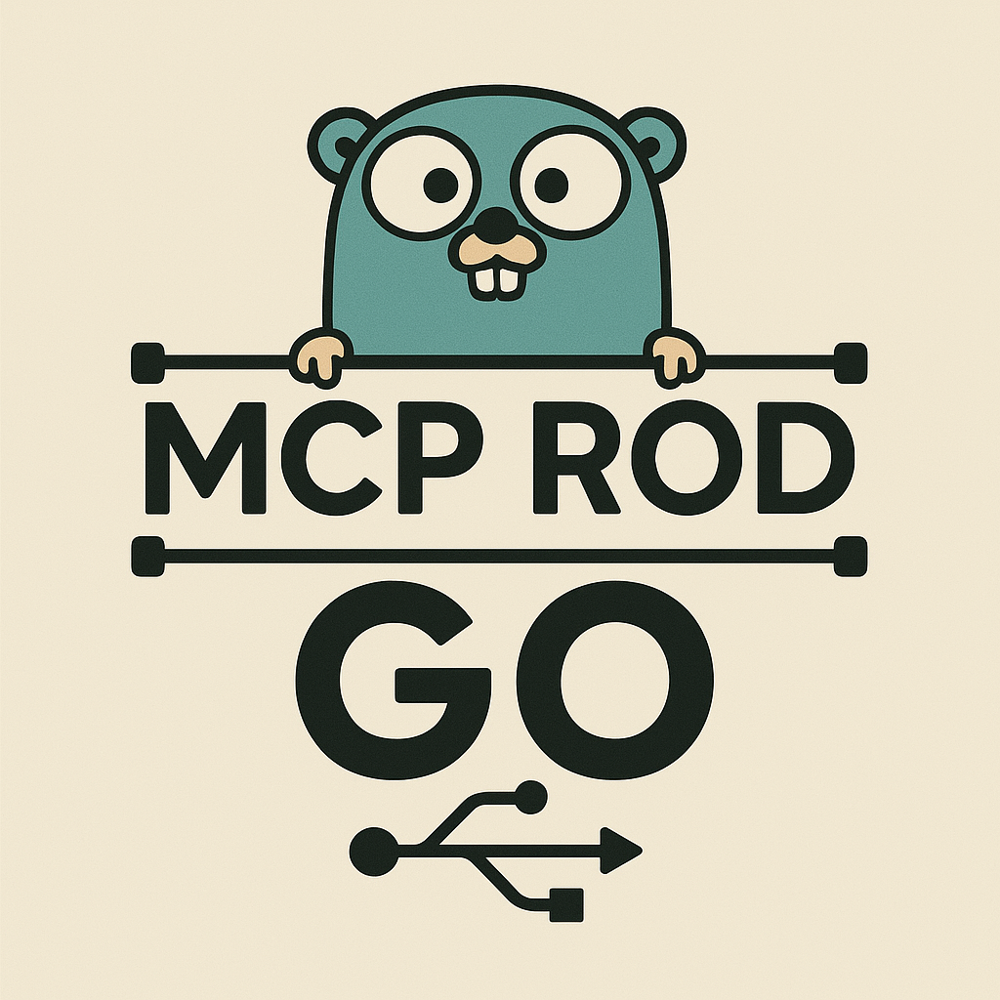

# Rod MCP Server

<div align="center">




<strong>Wow! It's awesome, now you can use the MCP server of Rod!🚀</strong>

<br>

<strong>Rod-MCP provides browser automation capabilities for your applications by using [Rod](https://github.com/go-rod/rod). The server provides many useful mcp tools enable LLMs to interact with the web pages, like click, take screenshot, save page as pdf etc.</strong>

</div>


<h5>Engilsh | <a href='./README_CN.md'> 中文 </a></h5>


## Features

- 🚀 Browser automation powered by Rod
- 🎯 Rich web interaction capabilities
  - Element clicking
  - Screenshot capture
  - PDF generation
  - And more...
- 🎨 Headless/GUI mode support
- ⚡ High performance and stability
- 🔧 Easy to configure and extend
- 🤖 Designed for LLMs interaction

## Installation

### Prerequisites

- Go 1.23 or higher
- Chrome/Chromium browser

### Steps

1. Clone the repository:
```bash
git clone https://github.com/go-rod/rod-mcp.git
cd rod-mcp
```

2. Install dependencies:
```bash
go mod tidy
```

3. Build the project:
```bash
go build
```

## Usage

### Basic Usage

1. Configure MCP:
```json
{
    "mcpServers": {
        "rod-mcp": {
            "command": "rod-mcp",
            "args": [
                "-c", "rod-mcp.yaml"
            ]
        }
    }
}
```

### Configuration

The configuration file supports the following options:
- serverName: Server name, default is "Rod Server"
- browserBinPath: Browser executable file path, use system default browser if empty
- headless: Whether to run the browser in headless mode, default is false
- browserTempDir: Browser temporary file directory, default is "./rod/browser"
- noSandbox: Whether to disable sandbox mode, default is false
- proxy: Proxy server settings, supports socks5 proxy

## Project Structure

```
rod-mcp/
├── assets/          # Static resources
├── banner/          # Banner resources
├── cmd.go           # Command line processing
├── main.go          # Program entry
├── resources/       # Resource files
├── server.go        # Server implementation
├── tools/           # Tool implementation
├── types/           # Type definitions
└── utils/           # Utility functions
```

## Contribution Guidelines

Welcome to submit Pull Request or create Issue!

## License

This project is licensed under the MIT License - see the [LICENSE](LICENSE) file
